

# 🚗 Unidrive — Smart Campus Carpooling App

*A full-stack campus carpooling mobile application for safe ride sharing, smart matching, and real-time communication between students.*

[Overview](#-overview) • [Architecture](#-architecture) • [Quick Start](#-quick-start) • [Features](#-core-features) • [Roadmap](#-roadmap)

---

## 📋 Table of Contents

- [🎯 Overview](#-overview)
- [🏗️ Architecture](#-architecture)
- [🛠️ Technology Stack](#️-technology-stack)
- [🧩 Core Features](#-core-features)
- [🚀 Quick Start](#-quick-start)
- [⚙️ Configuration](#️-configuration)
- [📁 Project Structure](#-project-structure)
- [🔐 Security Notice](#-security-notice)
- [🗺️ Roadmap](#️-roadmap)
- [🎯 What This Project Demonstrates](#-what-this-project-demonstrates)
- [📸 Screenshots](#-screenshots)
- [👤 Author](#-author)

---

## 🎯 Overview

**Unidrive** is a **full-stack campus carpooling mobile app** built with **React Native (Expo)** for the frontend and **Node.js / Express + MongoDB** for the backend.

It enables students to:

- safely share rides inside and around campus
- communicate directly in real time
- filter rides using smart preferences
- detect nearby rides using location-based logic
- rate drivers after ride completion

### Problem Statement

Campus transportation often suffers from:

- ❌ Unorganized ride coordination
- ❌ No trusted student-only ride-sharing flow
- ❌ Poor ride visibility and filtering
- ❌ No integrated communication between driver and passenger
- ❌ No post-ride rating system for trust

### ✅ Unidrive Solution

- ✔ Student-friendly ride publishing & joining
- ✔ Real-time private messaging
- ✔ Smart search and filtering
- ✔ Live location & map-based ride discovery
- ✔ Driver rating and profile stats
- ✔ Secure authentication + password reset flow

---

## 🏗️ Architecture

### System Overview

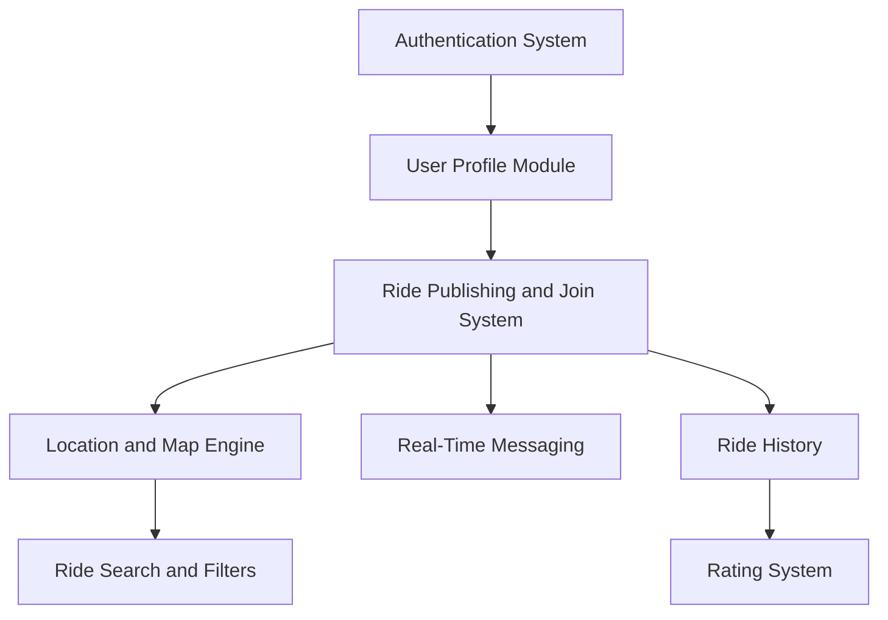
🛠️ Technology Stack
Layer	Technology	Purpose
Mobile Frontend	React Native (Expo Router)	Mobile UI, navigation, routing
Language	TypeScript	Strong typing and maintainability
Networking	Axios	API communication
Local Storage	AsyncStorage	Persist user/session data
Maps	React Native Maps	Location and map integration
Backend	Node.js + Express.js	REST API and business logic
Database	MongoDB + Mongoose	Data storage and schema modeling
Auth	JWT + Bcrypt	Secure login/session
Email	Nodemailer	Password reset emails
Security Utils	Crypto	Token generation for reset flow
🧩 Core Features
1️⃣ Authentication System

User registration

Secure login with JWT

Profile update

Password reset via email (token-based)

Protected user flow

2️⃣ Password Reset System

The app includes a password reset workflow using Nodemailer and token-based verification.

Reset Flow

Request Reset → Generate Token → Send Email → Verify Token → Set New Password

⚠️ To activate it, you must configure your own email credentials in .env.

3️⃣ Profile Features

Upload profile picture 📷

Real profile photo displayed in:

Messages

Rides

Driver info

Update vehicle information

Update ride preferences:

No Smoking

Pets Allowed

etc.

View profile stats:

⭐ Overall rating

🚗 Total rides

4️⃣ Smart Location & Map System

Automatic current location detection

Select:

Pickup point

Destination

Interactive map integration

Nearby ride search (within 100 meters)

Search by:

destination

departure point

5️⃣ Ride System

Users can:

Publish a ride

Join a ride

Participate as a passenger

Act as a driver

Ride History Includes

Hosted rides (driver)

Participated rides (passenger)

Upcoming rides

Completed rides

6️⃣ Advanced Ride Search & Filtering

Users can browse and filter rides by:

Female Only

Price (Low → High)

Price (High → Low)

Air Condition

No Smoking

Pets Allowed

Nearby rides (within 100m)

7️⃣ Real-Time Messaging

Private chat between driver and passenger

Displays real user profile photo

"You:" indicator for sent messages

Integrated call button 📞 to directly call:

driver

passenger

When clicking the call icon, the app opens the phone dialer automatically.

8️⃣ Rating System

After ride completion:

Passenger can rate the driver

Ratings automatically update:

Driver overall rating

Profile statistics

🚀 Quick Start
Prerequisites

Node.js >= 18

npm >= 9

Expo CLI (or npx expo)

MongoDB (local or Atlas)

1️⃣ Backend Setup
cd server
npm install
npm start

Runs on:

http://YOUR_LOCAL_IP:5000
2️⃣ Frontend Setup
npm install
npx expo start
⚙️ Configuration
🔎 IMPORTANT — Change the IP Address

This project uses a local IP address for frontend-backend communication.

Before running on your own machine:

1. Find your IP address (Windows)
ipconfig

Look for:

IPv4 Address

Example:

192.168.1.45
2. Replace the backend IP in the project

Search in the project for:

192.168.1.13

Replace it with your own IP:

http://YOUR_IP:5000

Example:

http://192.168.1.45:5000

⚠️ If you do not change the IP, the mobile app will not connect to the backend.

3. Environment Variables (.env)

Create a .env file in your backend (/server) and add:

EMAIL_USER=your_email@gmail.com
EMAIL_PASS=your_gmail_app_password
JWT_SECRET=your_jwt_secret
MONGODB_URI=your_mongodb_connection_string

⚠️ For security reasons, original credentials were removed from this repository.

 
📁 Project Structure
unidrive/
├── app/                    # React Native (Expo Router) frontend
│   ├── (auth)/
│   ├── rides/
│   ├── messages/
│   ├── profile/
│   └── ...
├── server/                 # Node.js / Express backend
│   ├── controllers/
│   ├── routes/
│   ├── models/
│   ├── middleware/
│   ├── utils/
│   └── server.js
├── assets/
├── package.json
└── README.md

🔐 Security Notice

For security reasons:

✅ Email credentials were removed

✅ App passwords were removed

✅ Sensitive values must be stored in .env

❌ Never push real passwords or secrets to GitHub

Recommended Best Practices

Use .gitignore for .env

Use strong JWT secrets

Use Gmail App Password (not your normal Gmail password)

Rotate credentials if accidentally exposed

🗺️ Roadmap

 Ride request approval / booking confirmation flow

 Push notifications

 In-app live location sharing during rides

 Admin moderation dashboard

 Ride cancellation policies

 Enhanced trust and verification features

 Payment integration (future version)

🎯 What This Project Demonstrates

Full-stack mobile architecture

Secure authentication flow

Token-based password reset

Map and geolocation integration

Driver-passenger messaging system

Rating system logic

Smart filtering algorithms

Clean mobile UI/UX design
## 📸 Screenshots

### 🔐 Login
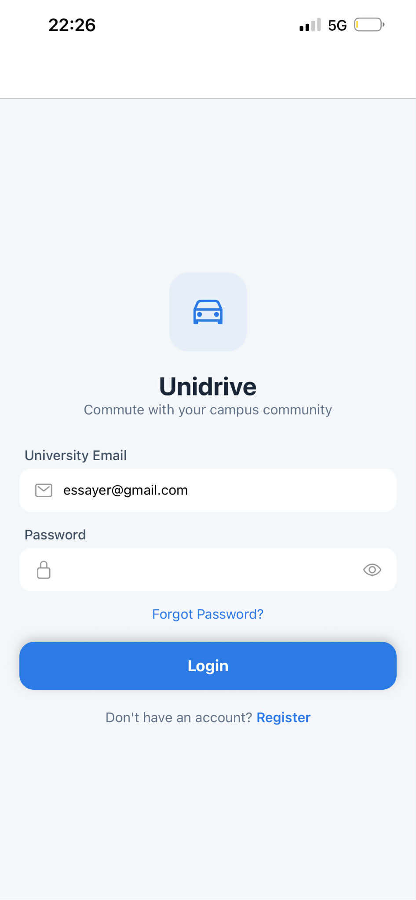

### 📝 Register
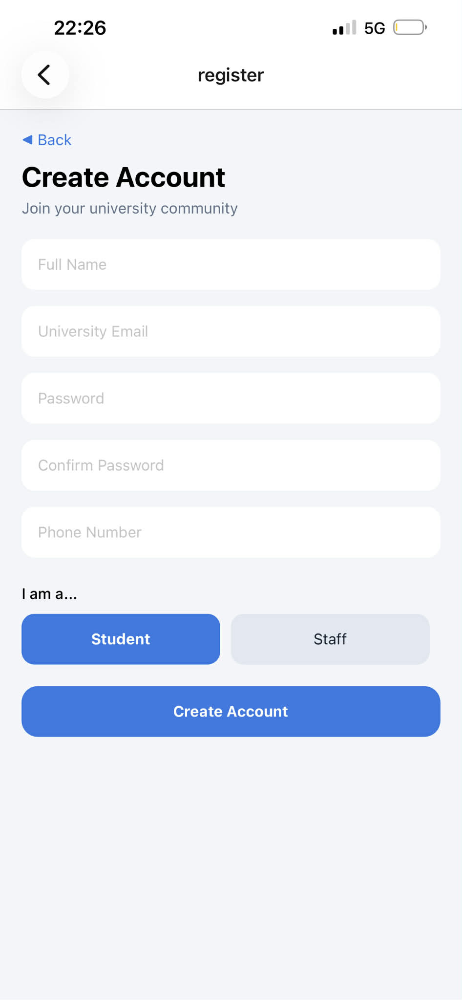

### 🏠 Home
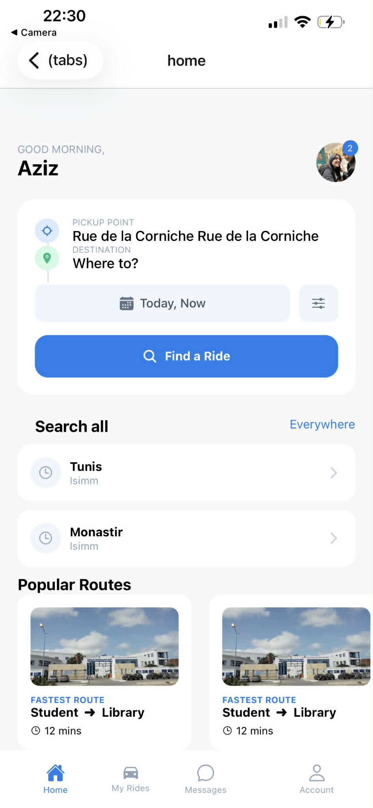

### 🚗 Publish Ride
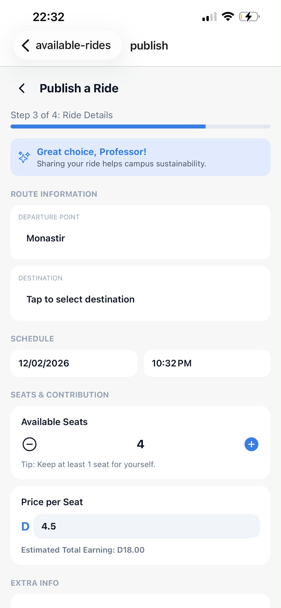

### 🔎 Search Ride
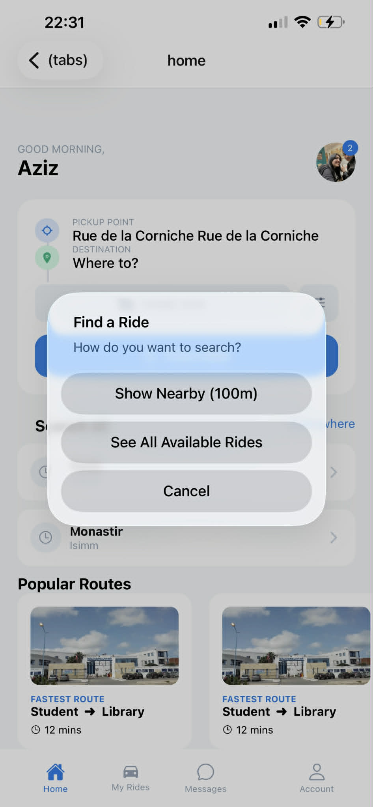

### 📍 Select Pickup
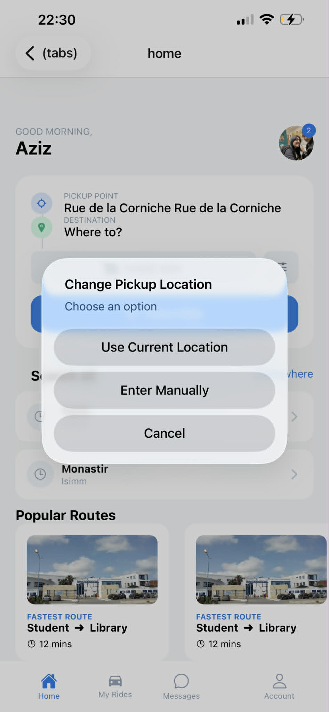

### 🎯 Select Destination
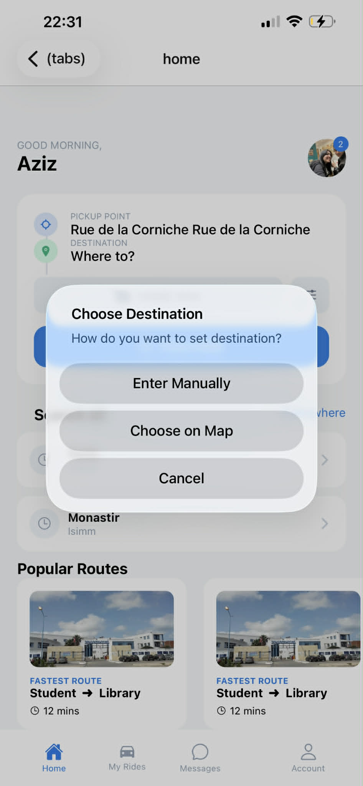

### 📍 Nearby Rides
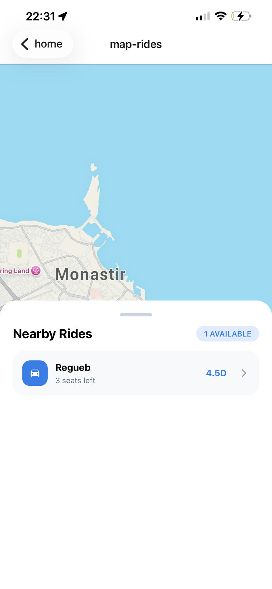

### 💬 Messages
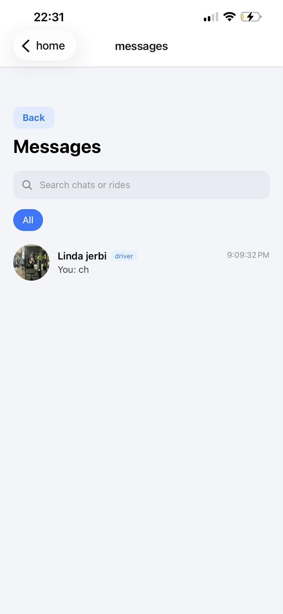

### 📖 My Rides
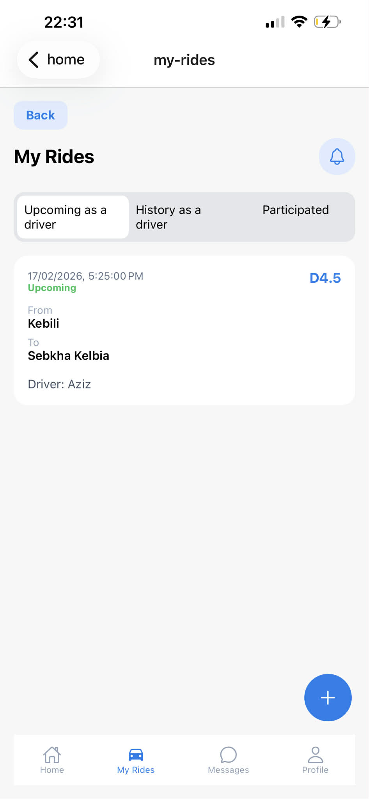

### 👤 Profile
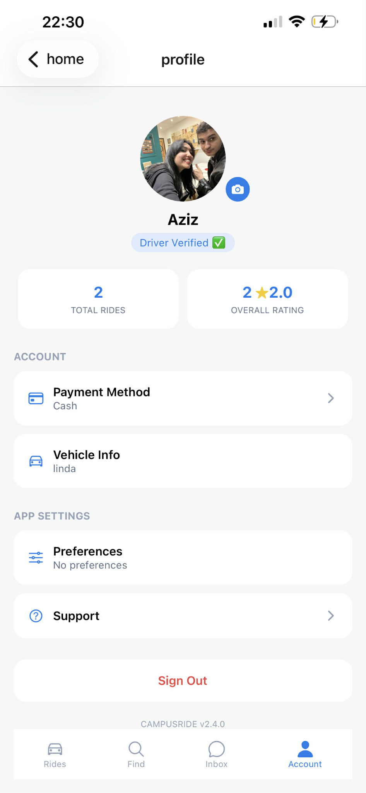

### ✏️ Edit Profile
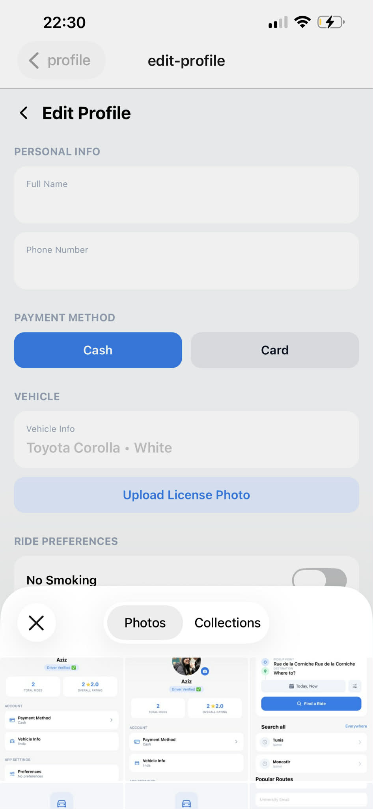

### 🔐 Forgot Password
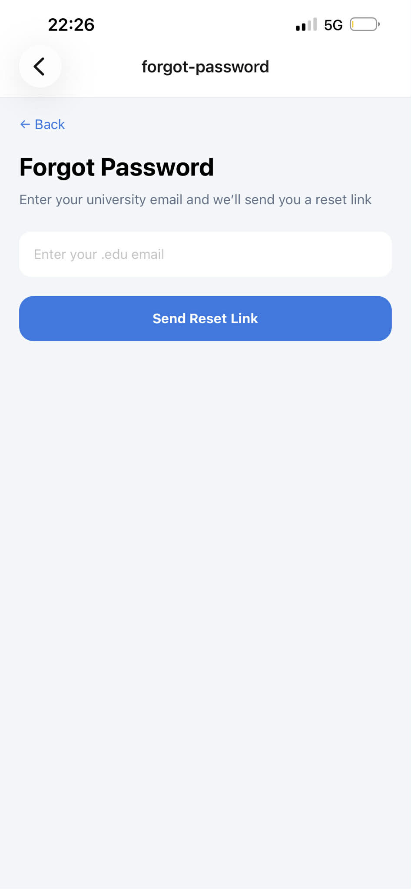

### 📞 Support
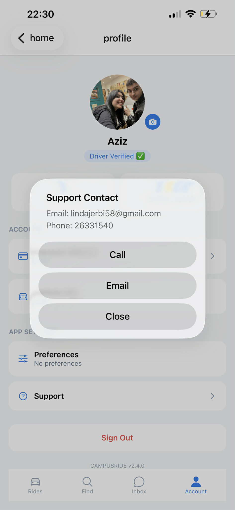

### 🚗 Available Rides
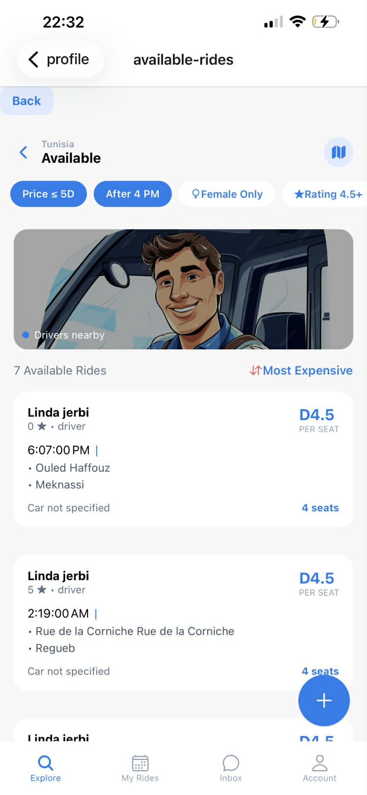

### 📍 Choose Location
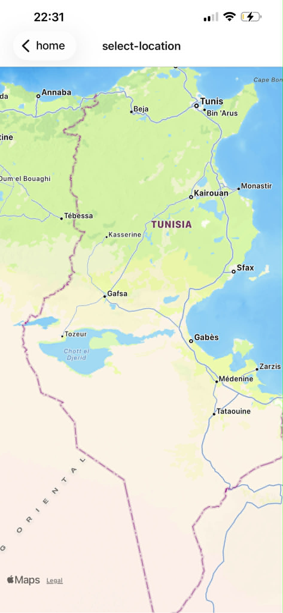

